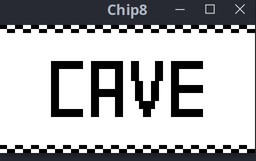

# Chip8

A chip8 emulator written in Rust.

The emulator's core is backend-independent, relying on three functions
+ `render()`
+ `play_sound()`
+ `check_input()`

to be provided by the backend.
In this implementation, SDL2 is used as the backend.

#### Dependencies
```$xslt
sudo apt-get install libsdl2-dev
```
#### Build instructions
```$xslt
cargo build
```

#### Run instructions
```$xslt
./chip8 roms/CAVE.ch8
```
or
```$xslt
cargo run roms/CAVE.ch8
```

#### Screenshots

|
:-----------:|:-----------:
|
